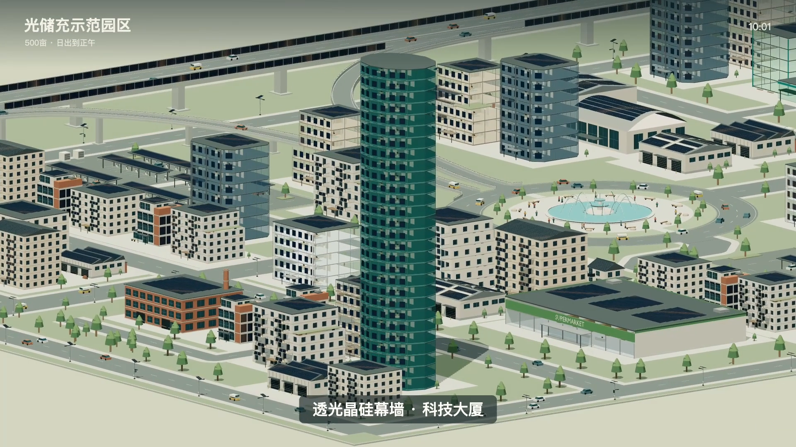

# 光储充示范园区 · 完整项目包

500亩微缩园区，包含多样化光伏建筑、储能充电设施、高架声屏障与匝道、动态车流行人、日出发电微光及云浏览。



## 下载与还原

完整工程及视频采用分卷 ZIP 保存。下载本文件夹中的全部 `.part001`、`.part002` 等分卷，以及 `MANIFEST.json`、`restore.py`。

推荐在仓库首页选择 **Code → Download ZIP**，解压后进入 `3D Model/光储充示范园区`。macOS 可双击 **合并解压.command**；其他系统或终端运行：

```sh
python3 restore.py
```

脚本使用 Python 3 标准库，自动检查每个分卷及完整 ZIP 的 SHA-256，再解压成 `pv-park-v06` 文件夹。不会覆盖已有工程目录。不需要安装额外依赖。分卷不是独立 ZIP，不能分别解压。

## 包内成果

- **Blender**：`pv_park_500mu_v06.blend` 可编辑园区，以及建筑/设施资产库。
- **GLB**：52款独立资产及完整园区，共53个文件。
- **网页**：`web/`、本地依赖和音效；双击工程中的 `启动预览.command`，或在工程目录执行 `python3 -m http.server 8876 --bind 127.0.0.1` 后访问 `http://127.0.0.1:8876/web/`。
- **视频**：`video/光储充示范园区_云浏览_慢速版.mp4`，1920×1080、30fps、86.566667秒，H.264/AAC，27条烧录中文字幕。
- **字幕**：SRT、ASS及镜头字幕配置。
- **其他**：参数化脚本、效果图、验证记录、[统一需求提示词](项目需求提示词.md)。

## 最后确认的设置

名称为「光储充示范园区」；网页时间05:00—12:00，06:00日出，90秒源动画按1.3倍播放，全程69.2秒。导出视频按当前网页速度的80%播放，保留云浏览轨迹、车流、光伏微光和柔和日出音效，字幕去掉“云浏览”等状态前缀。

Blender保留12fps、90秒源动画；网页的更新时间映射与导出视频以各自成品为准。工程内README提供更详细说明。

打包排除了本地缓存、日志、历史备份、临时原始编码流与逐帧截图。最终MP4和模型保持原文件字节，所有包内文件的校验值见 `MANIFEST.json`。原有仓库文件不受影响。
