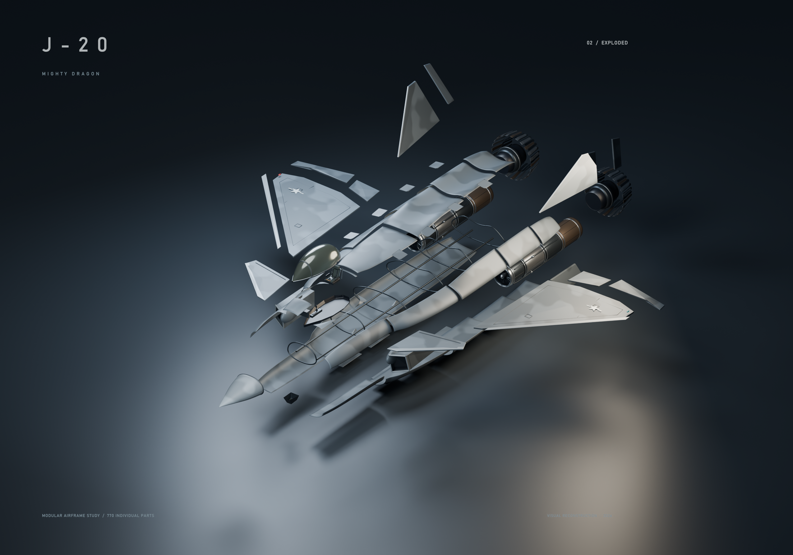
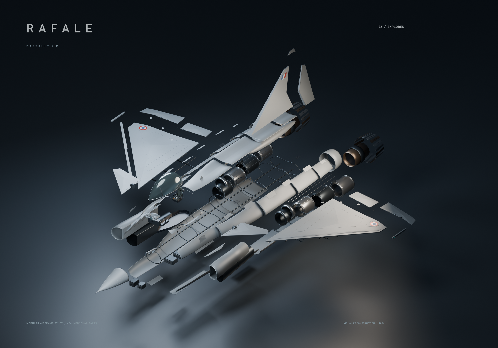
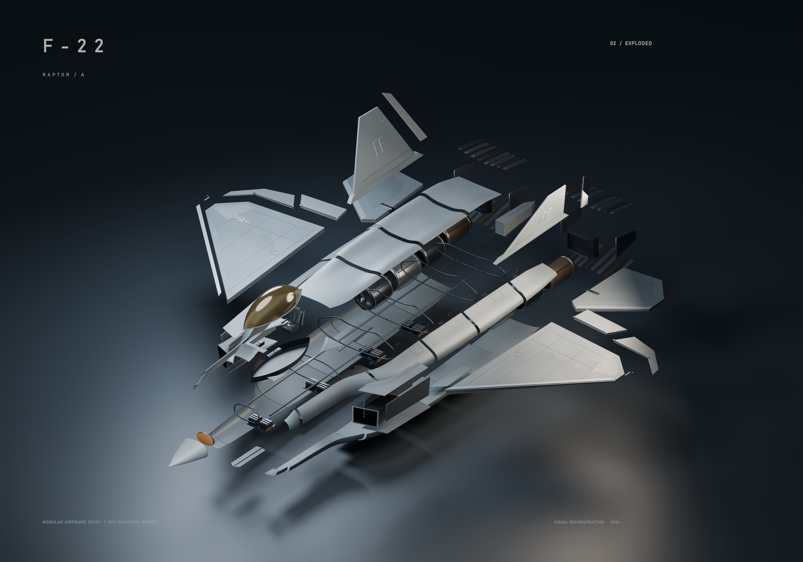

# J-20 · Rafale C · F-22A 可拆分飞机模型

三款 Blender 飞机艺术模型，包含独立零件、完整装配与爆炸展开状态、往返动画及简易操作面板。模型根据公开照片与外观资料创作，内部结构为展示用示意。

| 机型 | 独立零件对象 | 拆分组 | Blender 模型 |
| --- | ---: | ---: | --- |
| J-20 歼-20 | 770 | 166 | [J20_Modular.blend](aircraft/J20/J20_Modular.blend) |
| Rafale C 阵风 | 656 | 136 | [Rafale_Modular.blend](aircraft/Rafale/Rafale_Modular.blend) |
| F-22A 猛禽 | 862 | 123 | [F22_Modular.blend](aircraft/F22/F22_Modular.blend) |

静态渲染分辨率为 **3000 × 2100**；每款附 **8 秒**往返展开预览视频。

## 预览

### J-20

[装配图](aircraft/J20/J20_01_Assembled.png) · [爆炸图](aircraft/J20/J20_02_Exploded.png) · [尾部细节](aircraft/J20/J20_03_Rear.png) · [动画 MP4](aircraft/J20/J20_Explode_Animation.mp4)



### Rafale C

[装配图](aircraft/Rafale/Rafale_01_Assembled.png) · [爆炸图](aircraft/Rafale/Rafale_02_Exploded.png) · [尾部细节](aircraft/Rafale/Rafale_03_Rear.png) · [动画 MP4](aircraft/Rafale/Rafale_Explode_Animation.mp4)



### F-22A

[装配图](aircraft/F22/F22_01_Assembled.png) · [爆炸图](aircraft/F22/F22_02_Exploded.png) · [尾部细节](aircraft/F22/F22_03_Rear.png) · [动画 MP4](aircraft/F22/F22_Explode_Animation.mp4)



## 使用

1. 用 Blender 打开对应的 `*_Modular.blend`。
2. 在时间轴查看 **第 1 帧：装配 → 第 100 帧：展开 → 第 220 帧：复原**。按空格播放动画。
3. 使用一键面板时，在 Blender 文本编辑器打开对应控制脚本，按 **Alt+P** 运行；回到 3D 视图按 **N** 打开侧栏。

| 机型 | 控制脚本 | 侧栏标签 | 详细说明 |
| --- | --- | --- | --- |
| J-20 | [J20_Controls.py](aircraft/J20/J20_Controls.py) | J20 | [使用说明](aircraft/J20/使用说明.txt) |
| Rafale C | [Aircraft_Controls.py](aircraft/Rafale/Aircraft_Controls.py) | Aircraft | [使用说明](aircraft/Rafale/使用说明.txt) |
| F-22A | [Aircraft_Controls.py](aircraft/F22/Aircraft_Controls.py) | Aircraft | [使用说明](aircraft/F22/使用说明.txt) |

面板提供完整装配、全部展开、动画播放与展开程度滑条。滑条定位第 28–100 帧，保留原动画缓动。Rafale C 与 F-22A 另提供“显示画面文字”开关。

零件可在大纲视图中单独选择、编辑或隐藏。每次重新打开 Blender 后运行一次控制脚本，也可将其安装为插件。

## 目录

```text
aircraft/
├── J20/
├── Rafale/
└── F22/
```

每个机型目录包含一个 Blender 模型、装配／爆炸／尾部三张 PNG 渲染图、一段 MP4 动画、控制脚本和中文使用说明。
